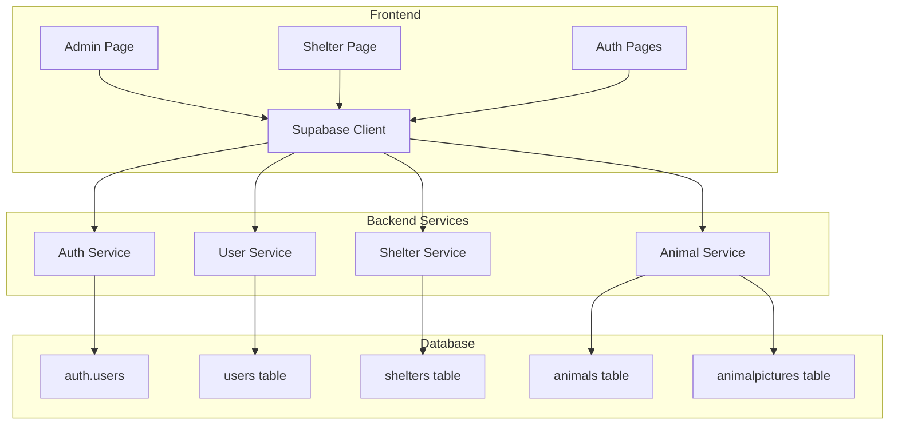

# Design Document

## Overview

The pet adoption system restructure involves creating a well-organized, role-based application with proper Supabase integration. The system will support three user roles (user, admin, shelter admin) with distinct interfaces and permissions. The architecture emphasizes clean separation of concerns with a dedicated backend folder structure, consistent theming, and proper database relationships.

## Architecture

### High-Level Architecture



### Folder Structure

```
src/
├── pages/
│   ├── admin/
│   │   └── page.tsx
│   ├── shelter/
│   │   └── page.tsx
│   └── auth/
│       ├── login.tsx
│       └── signup.tsx
├── backend/
│   ├── services/
│   │   ├── authService.ts
│   │   ├── shelterService.ts
│   │   ├── animalService.ts
│   │   └── userService.ts
│   ├── types/
│   │   └── database.ts
│   └── supabase.ts
├── components/
│   ├── ui/
│   │   ├── forms/
│   │   ├── tables/
│   │   └── common/
│   └── layout/
└── utils/
    └── auth.ts
```

## Components and Interfaces

### Core Components

#### 1. Supabase Client Initialization
- **File**: `src/backend/supabase.ts`
- **Purpose**: Initialize Supabase client using environment variables
- **Exports**: Configured Supabase client instance

#### 2. Authentication Service
- **File**: `src/backend/services/authService.ts`
- **Purpose**: Handle signup, login, and role-based authentication
- **Key Methods**:
  - `signUp(email, password, userData)` - Creates auth user and users table record
  - `signIn(email, password)` - Authenticates user
  - `getCurrentUser()` - Gets current user with role
  - `signOut()` - Logs out user

#### 3. Admin Page Component
- **File**: `src/pages/admin/page.tsx`
- **Purpose**: Interface for system admins to manage shelters
- **Features**:
  - Shelter creation form
  - Shelter listing table
  - Role-based access control
  - Themed UI components

#### 4. Shelter Page Component
- **File**: `src/pages/shelter/page.tsx`
- **Purpose**: Interface for shelter admins to manage animals
- **Features**:
  - Animal creation form with image upload
  - Animal listing (filtered by shelter)
  - Role-based access control
  - Themed UI components

### Service Layer Architecture

#### Shelter Service
```typescript
interface ShelterService {
  createShelter(shelterData: ShelterCreateData): Promise<Shelter>
  getShelters(): Promise<Shelter[]>
  getShelterById(id: string): Promise<Shelter>
  updateShelter(id: string, data: ShelterUpdateData): Promise<Shelter>
}
```

#### Animal Service
```typescript
interface AnimalService {
  createAnimal(animalData: AnimalCreateData): Promise<Animal>
  getAnimalsByShelter(shelterId: string): Promise<Animal[]>
  updateAnimal(id: string, data: AnimalUpdateData): Promise<Animal>
  uploadAnimalPictures(animalId: string, files: File[]): Promise<AnimalPicture[]>
}
```

## Data Models

### User Model
```typescript
interface User {
  id: string; // UUID matching auth.users.id
  full_name: string;
  email: string;
  phone?: string;
  address?: string;
  role: 'user' | 'admin' | 'shelter_admin';
  shelter_id?: string; // For shelter admins
  created_at: string;
}
```

### Shelter Model
```typescript
interface Shelter {
  id: string;
  name: string;
  location: string;
  contact?: string;
}
```

### Animal Model
```typescript
interface Animal {
  id: string;
  name: string;
  breed?: string;
  gender?: string;
  age?: number;
  color?: string;
  height?: number;
  weight?: number;
  vaccinated?: boolean;
  shelter_id: string;
  pictures?: AnimalPicture[];
}
```

### Animal Picture Model
```typescript
interface AnimalPicture {
  id: string;
  animal_id: string;
  image_url: string;
}
```

## Error Handling

### Authentication Errors
- Invalid credentials → Display user-friendly login error
- Unauthorized access → Redirect to login with message
- Role mismatch → Show access denied message

### Database Errors
- Connection issues → Show retry option
- Validation errors → Display field-specific messages
- Foreign key violations → Show relationship error messages

### File Upload Errors
- File size limits → Show size restriction message
- Invalid file types → Display accepted formats
- Upload failures → Provide retry mechanism

## Testing Strategy

### Unit Testing
- Service layer methods
- Authentication utilities
- Data validation functions
- Component rendering

### Integration Testing
- Supabase client initialization
- Database operations
- Authentication flow
- File upload process

### End-to-End Testing
- Admin shelter management workflow
- Shelter animal management workflow
- Role-based access control
- Authentication and authorization

## Security Considerations

### Role-Based Access Control
- Server-side role verification
- Route protection based on user roles
- Database-level row-level security (RLS)

### Data Validation
- Input sanitization on all forms
- File upload validation
- SQL injection prevention through Supabase

### Authentication Security
- Secure password requirements
- Session management through Supabase
- Protected API endpoints

## Performance Considerations

### Database Optimization
- Proper indexing on foreign keys
- Efficient queries with joins
- Pagination for large datasets

### Frontend Optimization
- Lazy loading of components
- Image optimization for animal pictures
- Caching of frequently accessed data

### Real-time Updates
- Supabase real-time subscriptions for live data
- Optimistic updates for better UX
- Proper error handling for real-time failures